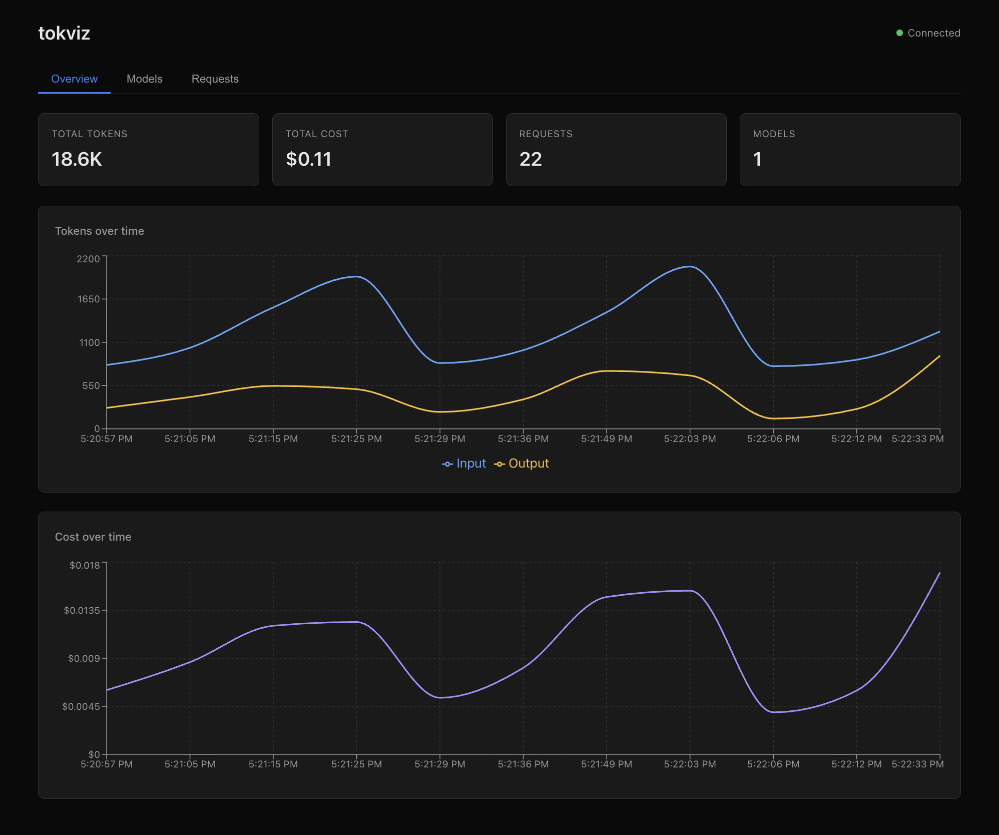

# tokviz

See where your LLM tokens go.



One command. Real-time token usage and cost dashboard. No database, no Docker, no config.

```bash
npx tokviz
```

tokviz receives standard [OpenTelemetry](https://opentelemetry.io/) traces, filters for LLM spans (`gen_ai.*` attributes), and displays token consumption and costs in a live dashboard. When you stop it, it's gone. Nothing persists.

## Why

You're building an app that calls LLMs. You want to know:

- How many tokens each request burns
- What it costs per interaction
- Which models are actually being used (routing, fallbacks)
- Whether something is silently eating your budget

Existing tools are either too heavy (Langfuse, OpenLIT — databases, Docker, SDKs) or too generic (Aspire Dashboard — shows everything, highlights nothing). tokviz shows you LLM spend and nothing else.

## Quick start

```bash
npx tokviz
```

Point your OTLP exporter at `http://localhost:4318` and you're done.

Works with [Dev Proxy](https://aka.ms/devproxy), the OpenTelemetry SDKs, and anything that emits `gen_ai.*` span attributes following the [OpenTelemetry Gen AI semantic conventions](https://opentelemetry.io/docs/specs/semconv/gen-ai/).

### With Dev Proxy

```json
{
  "plugins": [{
    "name": "OpenAITelemetryPlugin",
    "enabled": true,
    "pluginPath": "~appFolder/plugins/dev-proxy-plugins.dll"
  }]
}
```

### With OpenTelemetry SDK

```bash
export OTEL_EXPORTER_OTLP_ENDPOINT=http://localhost:4318
```

## What you see

**Overview** — Token usage and cost over time, summary cards for total tokens, cost, requests, and unique models.

**Models** — Breakdown per response model: request count, input/output tokens, total cost.

**Requests** — Every request with timestamp, model, operation, tokens, cost, and duration. Click any row to see all span attributes.

## Options

```
npx tokviz [options]

--port <number>   Port to listen on (default: 4318)
--no-open         Don't auto-open the browser
```

## How it works

tokviz is an OTLP HTTP receiver that:

1. Accepts traces on `POST /v1/traces` (protobuf and JSON)
2. Filters spans — only processes those with `gen_ai.*` attributes
3. Stores everything in memory — no database, no disk writes
4. Pushes updates to the browser over WebSocket — zero polling

Supports both `application/x-protobuf` and `application/json` content types.

## Development

```bash
git clone https://github.com/waldekmastykarz/tokviz.git
cd tokviz
npm install
npm run dev
```

Opens the Vite dev server at `http://localhost:5173` with hot reload. The Express backend runs on port 4318.

## License

MIT
